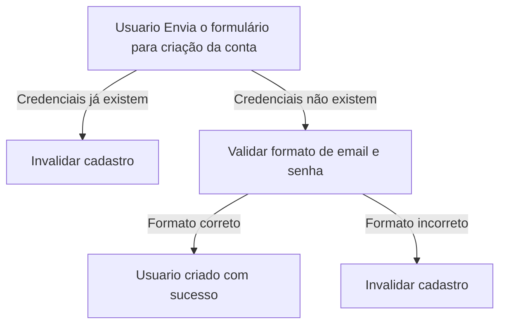
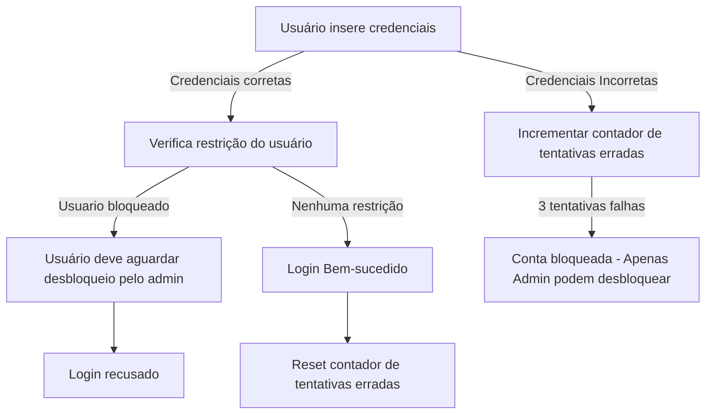
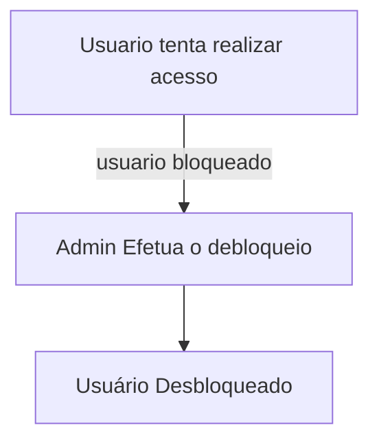
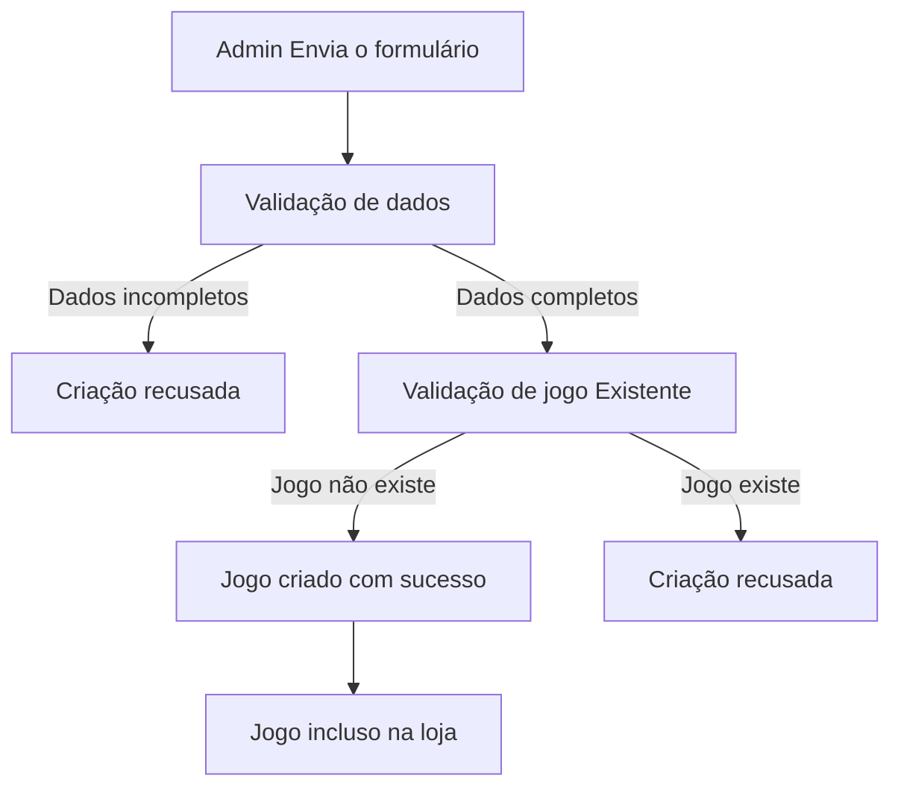
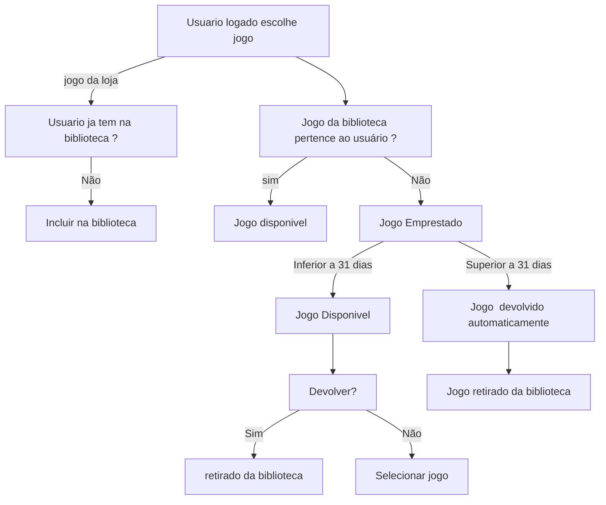

# 🚀 Fiap Cloud Games (FCG)
Fiap Cloud Games (FCG) é uma API para uma plataforma de streaming  de jogos digitais, com um diferencial importante: a possibilidade de emprestar jogos entre usuários. O sistema também contempla controle de bibliotecas de jogos, gestão de usuários, regras de segurança e administração de servidores para partidas online.

# 🎯 Objetivos 

- Proporcionar um sistema de empréstimo de jogos entre usuários.

- Controlar bibliotecas individuais de jogos por usuário.

- Garantir segurança no login, controle de tentativas, bloqueios e recuperação de conta.

- Oferecer funcionalidades específicas para administradores, como criação de jogos e desbloqueio de contas.

- Servir como base para um sistema escalável e modular de jogos via API RESTful.


# 🪛 Como usar

## 1. Pré-requisitos

Antes de executar a API, você precisa ter:

- .NET SDK 8.0+

- SQL Server instalado localmente

- Visual Studio 2022 ou superior (ou outro editor com suporte a .NET 8)


## 2. Clonando o repositório

```
git clone https://github.com/humbertoluis22/FIAP_Cloud_Games.git
cd fiap-cloud-games
```

## 3. Restaure os pacotes e compile a solução

```
dotnet restore
dotnet build
```

## 4. Execute as migrações e crie o banco

Certifique-se de que a connection string em appsettings.json aponta corretamente para seu SQL 
Server. Depois, aplique as migrations:

```
 add-migration "IncluindoBancoETabela" -StartupProject InfraEstructure
```

Logo em seguida faça update da migração para finalizar a migração :

```
Update-Database -StartupProject InfraEstructure
```

# 🧭 Descrição de uso
A aplicação está dividida em camadas:

- Core: contém as entidades, regras de negócio e interfaces.

- InfraEstructure: implementação dos repositórios e contexto de dados.

- API: onde estão os controllers e a configuração da aplicação.

# 📃 Funcionalidades principais:

- Cadastro e login de usuários com segurança reforçada.

- Criação e gestão de jogos por administradores.

- Inclusão de jogos na biblioteca pessoal.

- Solicitação de devolução (com regras de tempo).

- Empréstimo de jogos

# ⚙️ Dependências
O projeto utiliza as seguintes bibliotecas principais:

- Microsoft.EntityFrameworkCore

- Microsoft.EntityFrameworkCore.SqlServer

- Microsoft.EntityFrameworkCore.Design

- Microsoft.EntityFrameworkCore.Tools

- Swashbuckle.AspNetCore (Swagger)

# 🔄️ fluxos 

## 🔁 FLuxo de criação do Usuário


## 🔐 Fluxo de login do Usuário



## 🔁 FLuxo de  Desbloqueio e Recuperação 



## 🛠️ Fluxo de criação do jogo


## 🪃 Fluxo de Interação com Jogo 



## 📌 Regras de Login e Criação de conta

- ✔️ Bloqueio após 3 tentativas erradas consecutivas;
- ✔️ Reset do contador de tentativas erradas no login bem-sucedido;
- ✔️ Apenas o Admin pode desbloquear a conta;
- ✔️ Senha do Usuário é de no mínimo 8 caracteres com números, letras e caracteres especiais


# 🗃️ Estrutura do Banco de Dados 

## 🪪 Tabela de Usuarios
Coluna |Tipo|Descrição|
|---|---|---|
Id | INT PRIMARY KEY | Id unico para controle de dados. 
UserName| VARCHAR(50) PK  | Nome identificador do usuario .
Senha | VARCHAR(50) | senha atual.
Email | VARCHAR(50) | senha atual.
TentativasErradas | INT DEFAULT 0 | Contador de tentativas de login com falha.
Bloqueado | BOOLEAN DEFAULT FALSE | Indica se a conta está bloqueada
Perfil | ENUM('admin', 'user')  | Define se o usuário é admin ou comum.
DataCriacao | TIMESTAMP DEFAULT CURRENT_TIMESTAMP | Data de criação da conta.


## 🪪 Tabela de Admin
Coluna |Tipo|Descrição|
|---|---|---|
Id | INT PRIMARY KEY | Id unico para controle de dados.
UserName| VARCHAR(50) PK  | Nome identificador do usuario .
Senha | VARCHAR(50) | senha atual.
Email | VARCHAR(50) | senha atual.
DataCriacao | TIMESTAMP DEFAULT CURRENT_TIMESTAMP | Data de criação da conta.


## 📼 Tabela de Jogos
Coluna |Tipo|Descrição|
|---|---|---|
Id | INT PRIMARY KEY | Id unico para controle de dados. 
NomeJogo | VARCHAR(30) FK | Nome do Jogo.
genero | VARCHAR(30) | genero do Jogo. 
DataCriacao | TIMESTAMP DEFAULT CURRENT_TIMESTAMP | Data de criação do jogo.
Descricao| VARCHAR() | descrição do Jogo. Historia, genero,etc 
Desenvolvedor | VARCHAR() | Desenvolvedor do jogo
Preco | DECIMAL | Valor do jogo para " venda "

## 🗄️ Tabela de Biblioteca
Coluna |Tipo|Descrição|
|---|---|---|
Id | INT PRIMARY KEY AUTO_INCREMENT | Id unico para controle de dados. 
IdJogo | INT NOT NULL, FOREIGN KEY REFERENCES Jogos(id) | Referencia ao ID do jogo
IdUsuario |INT NOT NULL, FOREIGN KEY REFERENCES Usuarios(id) | Referencia ao ID do usuario
jogoEmprestado | BOOLEAN DEFAULT FALSE | Indica se o jogo é emprestado de alguem
estaEmprestado | BOOLEAN DEFAULT FALSE | Indica se o jogo esta emprestado para alguem
Data_aquisicao |  DATE NOT NULL | Data em que o jogo foi incluso na biblioteca

## 🎬 event storming
Link para miro :
https://miro.com/app/board/uXjVI0vuaz0=/?share_link_id=962473604390
